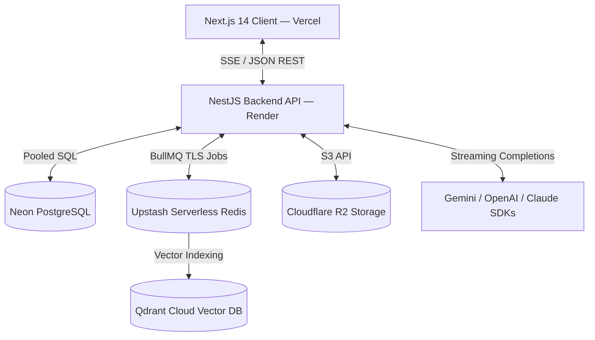

# 🌌 Damora AI — Enterprise Knowledge & RAG Platform

> A multi-tenant, enterprise-grade AI Knowledge Management Platform enabling organizations to ingest documents, index semantic vector chunks, and run real-time conversational RAG (Retrieval-Augmented Generation) chats over private files with strict role-based access control.

---

### 🌐 Live Production Deployment

| Service | Live Link | Status |
| :--- | :--- | :--- |
| **🚀 Web Application** | [**damora-ai-web.vercel.app**](https://damora-ai-web.vercel.app) |  |
| **📡 REST API** | [**damora-api.onrender.com/api**](https://damora-api.onrender.com/api) |  |
| **❤️ Service Health** | [**damora-api.onrender.com/api/health**](https://damora-api.onrender.com/api/health) |  |
| **📚 Interactive Swagger Docs** | [**damora-api.onrender.com/api/docs**](https://damora-api.onrender.com/api/docs) |  |

---

## 📸 Application Showcases

| 👥 Shared Workspace Discussions | 💬 Private AI Discussions |
|:---:|:---:|
|  |  |

| 📊 Workspace Analytics & Knowledge Gaps | ⚙️ Bring Your Own Key (BYOK) Security |
|:---:|:---:|
|  |  |

---

## 🚀 Key Architectural & Production Engineering Features

### 1. Production Hardened & Multi-Cloud Architecture
* **Serverless Database:** Hosted on **Neon PostgreSQL 16** with pooled connections and automated Prisma migration pipelines decoupled from application boot.
* **Cloud Vector Search:** 768-dimensional dense vector embeddings generated via Google Gemini `text-embedding-004` and indexed in **Qdrant Cloud**.
* **Async Job Processing:** Background document parsing (PDF, DOCX, TXT) and OCR tasks offloaded to **Upstash Serverless Redis** via **BullMQ** workers over TLS.
* **S3-Compatible Storage:** File uploads managed via **Cloudflare R2 Object Storage** (zero egress cost).
* **Infrastructure as Code (IaC):** Fully specified via `render.yaml` with build pipelines, automated SSL, health check probes, and fail-fast startup hooks.

### 2. Operational Health Monitoring & Observability
* **Parallel Service Probing:** The `/api/health` endpoint executes non-blocking `Promise.all` queries with 3-second hard deadlines against Database, Redis, Vector Store, and S3 Storage.
* **Degraded State Handling:** Returns `"degraded"` status if non-critical background services are down while maintaining uptime if PostgreSQL remains healthy.
* **Global Error Envelope:** All API errors return normalized JSON payloads `{ success: false, statusCode, message, path, timestamp }`.
* **Request Logger Middleware:** Logs every incoming HTTP request with method, path, status, and execution latency.

### 3. Advanced RAG (Retrieval-Augmented Generation)
* **Contextual Chunking:** Documents parsed and chunked with dynamic overlap to retain semantic boundaries.
* **Real-time SSE Streaming:** Token-by-token response streaming using NestJS `@Sse()` controller methods and RxJS observables.

### 4. Multi-Tenant Isolation & Security
* **Role-Based Access Control (RBAC):** `OWNER`, `ADMIN`, and `MEMBER` roles strictly enforced via NestJS Guards.
* **AES-256-CBC Encryption:** User-supplied API keys (OpenAI, Claude, Gemini) encrypted at rest before storage.

---

## 🛠️ System Design & Infrastructure


```mermaid
graph TD
    Client[Next.js 14 Client — Vercel] <-->|SSE / JSON REST| API[NestJS Backend API — Render]
    API <-->|Pooled SQL| DB[(Neon PostgreSQL)]
    API <-->|BullMQ TLS Jobs| Queue[(Upstash Serverless Redis)]
    Queue -->|Vector Indexing| Vector[(Qdrant Cloud Vector DB)]
    API <-->|S3 API| Storage[(Cloudflare R2 Storage)]
    API <-->|Streaming Completions| LLMs[Gemini / OpenAI / Claude SDKs]
```

---

## 📦 Tech Stack

* **Frontend:** Next.js 14 (App Router), React, Tailwind CSS, Zustand, Framer Motion, Lucide Icons
* **Backend:** NestJS, TypeScript, Passport.js JWT, RxJS, Compression (gzip), Helmet
* **Database & Caching:** PostgreSQL 16, Prisma ORM, Qdrant Cloud, Upstash Redis
* **Storage & Cloud:** Cloudflare R2, Vercel, Render Blueprint IaC, Docker Compose (Local Dev)

---

## ⚙️ Local Development Setup

### Prerequisites
* Node.js v20+ and `pnpm` v10+
* Docker Desktop (optional, for local postgres/redis/qdrant/minio)

### 1. Clone & Install
```bash
git clone https://github.com/lavneetsh/Damora-AI.git
cd Damora-AI
pnpm install
```

### 2. Configure Environment
Copy `.env.example` to `apps/api/.env`:
```bash
cp .env.example apps/api/.env
```

### 3. Start Local Environment
```bash
# Start database & local containers
docker-compose -f infrastructure/docker-compose.yml up -d

# Run Prisma schema migrations
pnpm --filter @damora/api run prisma:generate
pnpm --filter @damora/api run prisma:migrate:deploy

# Run local development server
pnpm dev
```

* **Frontend app:** `http://localhost:3000`
* **Backend API:** `http://localhost:3001/api`
* **Swagger Documentation:** `http://localhost:3001/api/docs`

---

## 📁 Repository Structure
```
├── apps/
│   ├── api/           # NestJS REST backend & Health monitoring
│   └── web/           # Next.js 14 SSR frontend
├── packages/
│   └── shared-types/  # DTOs & Typings shared between API & Web
├── infrastructure/    # Docker-compose local configs
├── render.yaml        # Infrastructure as Code deployment spec
└── package.json
```
